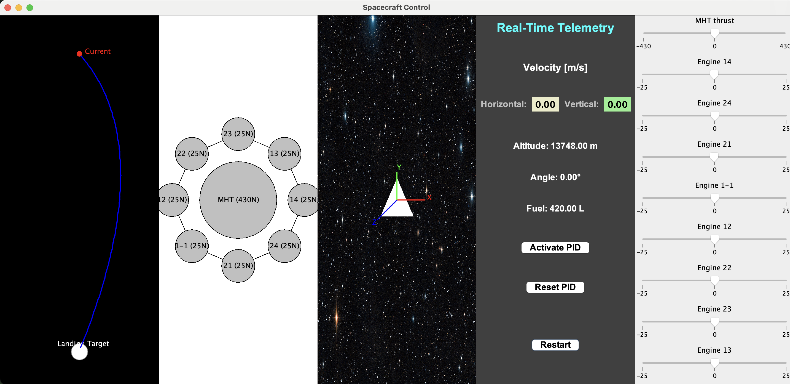

# Landing Moon Simulation

## Table of Contents

- [Introduction](#introduction)
- [Project Overview](#project-overview)
    - [Screens & Panels](#screens--panels)
    - [Key Classes and Their Roles](#key-classes-and-their-roles)
- [Installation Instructions](#installation-instructions)
- [Usage](#usage)
- [Report Part 1](#report-part-1)
- [Repository Link](#repository-link)
- [Acknowledgments](#acknowledgments)

---

## Introduction

This project is a basic simulator for autonomous landing of a spacecraft on the Moon. It was developed as part of an assignment for the **Introduction to Aerospace Engineering** course at Ariel University. The project, titled **"Landing Moon Simulation"**, was created by **Roni Michaeli** and is submitted along with **Neta Cohen**.

In this simulation, we focus on modeling a spacecraft (named *Bereshit* in our background material) and simulating its landing on the Moon. The simulator includes several interactive screens that allow the user to control engine thrusts, view the spacecraft’s real-time telemetry data, observe the engine statuses, and track the landing trajectory.

---

## Project Overview

### Screens & Panels

The simulator is divided into several distinct panels:

1. **Landing Panel**
    - **Purpose:** Displays the desired landing trajectory (as a fixed, curved Bezier line), the actual path traveled by the spacecraft (drawn in a different color), and the Moon (landing target) along with the current position of the spacecraft (shown as a red dot).
    - **Key Features:**
        - A fixed, curved landing trajectory is displayed to guide the landing.
        - The actual path is updated in real-time.
        - Collision detection is performed when the spacecraft reaches near-zero altitude; if the landing speed is above the threshold (≈277.78 m/s or 1000 km/h), a "Collision!" message is displayed, otherwise, "Successful Landing!" is shown.

2. **Engine Visual Panel**
    - **Purpose:** Provides a graphical representation of all engines (both the main and secondary ones).
    - **Key Features:**
        - Displays a large circle for the main engine and smaller circles for the eight secondary engines.
        - Active engines (with nonzero thrust) are highlighted in yellow.
        - The engines are connected by lines to give a clear layout of the spacecraft's engine configuration.

3. **Spacecraft Panel**
    - **Purpose:** Simulates and displays the spacecraft in flight over a space background (using the image located at `ex0/assets/space.jpg`).
    - **Key Features:**
        - Uses a model (the `Spacecraft` class) to compute movement (position, velocity, angle, fuel consumption, and altitude) based on engine thrust commands.
        - Records the path traveled by the spacecraft for later display in the Landing Panel.
        - Represents the spacecraft as a simple triangle.

4. **Telemetry Panel**
    - **Purpose:** Shows real-time telemetry data including horizontal speed, vertical speed, altitude, angle, and fuel remaining.
    - **Key Features:**
        - Data is updated in real-time.
        - Contains additional controls for activating a PID controller (for automated landing) and for restarting the simulation.
        - The PID controller can override manual engine thrust commands.

5. **Engine Sliders Panel**
    - **Purpose:** Allows the user to control the thrust of each engine using sliders.
    - **Key Features:**
        - The main engine slider allows values in the range of -430 to +430 N.
        - Each secondary engine slider allows values in the range of -25 to +25 N.
        - Each slider only updates its associated engine without affecting the others.

## Simulator Image

Below is an image of the simulator showing its layout with all panels:



### Key Classes and Their Roles

- **SpacecraftConstants**  
  Contains all global constants used in the simulation, including weights, engine forces, burn rates, initial fuel, initial altitude, and the simulation’s time step.

- **models/Spacecraft**  
  Represents the spacecraft’s state (position, velocity, angle, fuel, altitude, and traveled path) and provides methods to update its state based on engine thrust commands. It also provides getters for telemetry data (horizontal speed, vertical speed, altitude, angle, and fuel) and a reset method.

- **constants/Moon**  
  Contains parameters for the Moon, such as its radius, surface acceleration, and equilibrium speed. It includes a method to compute effective acceleration based on speed. Although not fully integrated into the control logic yet, it lays the groundwork for advanced simulations that include lunar physics.

- **controllers/PIDController**  
  A generic PID controller that calculates a control output based on error, integral, and derivative terms. This is used as the basis for the landing PID controller.

- **controllers/LandingPIDController**  
  Uses two PID controllers (one for vertical control and one for horizontal control) to compute desired engine thrust commands aimed at achieving a safe landing. The outputs are clamped to the valid thrust ranges for the main and secondary engines.

- **panels/EngineSlidersPanel**  
  Displays individual sliders for each engine, allowing the user to set the thrust for each engine manually. Only the slider corresponding to a given engine updates that engine's thrust value.

- **panels/SpacecraftPanel**  
  Renders the spacecraft and updates its state by delegating to the `Spacecraft` model. It uses the thrust values from the `EngineSlidersPanel` to compute movement and records the spacecraft's path.

- **panels/EngineVisualPanel**  
  Graphically displays the engine configuration, showing the status (active/inactive) of each engine via colored circles and connecting lines.

- **panels/TelemetryPanel**  
  Displays real-time telemetry data of the spacecraft (horizontal speed, vertical speed, altitude, angle, and fuel) and provides controls for restarting the simulation and toggling the PID controller.

- **panels/LandingPanel**  
  Displays the landing trajectory:
    - A fixed, curved landing path (Bezier curve) that represents the desired trajectory.
    - The actual path traveled by the spacecraft.
    - The landing target (Moon) and the current spacecraft position.
    - Collision detection logic based on landing speed.

- **controllers/PIDController & controllers/LandingPIDController**  
  These classes implement the PID control logic. The LandingPIDController uses the generic PID controller to generate thrust commands for vertical and horizontal adjustments to achieve a safe landing.

---

## Installation Instructions

1. **Prerequisites:**
    - Java JDK (version 8 or higher) must be installed on your system.
    - Git must be installed to clone the repository.

2. **Clone the Repository:**  
   Open a terminal and run:
   ```bash
   git clone https://github.com/roni5604/LandingMoonSimulation.git
   ```

3. **Project Structure:**  
   The repository is organized as follows:
   ```
   LandingMoonSimulation/
   ├── assets/
   │   ├── space.jpg
   │   └── simultor-image.png   (simulator image)
   ├── constants/
   │   └── Moon.java
   ├── controllers/
   │   ├── PIDController.java
   │   └── LandingPIDController.java
   ├── models/
   │   └── Spacecraft.java
   ├── panels/
   │   ├── EngineSlidersPanel.java
   │   ├── EngineVisualPanel.java
   │   ├── LandingPanel.java
   │   ├── SpacecraftPanel.java
   │   └── TelemetryPanel.java
   ├── SpacecraftConstants.java
   └── Main.java
   ```

4. **Compile the Project:**  
   Navigate to the project root directory and run:
   ```bash
   javac Main.java SpacecraftConstants.java constants/*.java controllers/*.java models/*.java panels/*.java
   ```

5. **Run the Simulator:**  
   In the same directory, execute:
   ```bash
   java Main
   ```

---

## Usage

When you run the simulator, the main window displays five panels arranged side-by-side:

- **Landing Panel (Far Left):**  
  Displays the desired landing trajectory (a curved blue line), the actual path of the spacecraft (an orange line), and the landing target (the Moon). It also shows collision or success messages when the spacecraft nears the Moon.

- **Engine Visual Panel (Left):**  
  Graphically displays the layout and status of all engines. Active engines light up in yellow.

- **Spacecraft Panel (Center):**  
  Shows the spacecraft flying against a space background. The spacecraft's state (position, velocity, angle, fuel, etc.) is updated in real-time based on engine thrust commands.

- **Telemetry Panel (Right-Center):**  
  Provides real-time telemetry data, including horizontal and vertical speeds, altitude, angle, and fuel remaining. It also has controls for restarting the simulation and for toggling a PID controller that can automate the landing process.

- **Engine Sliders Panel (Far Right):**  
  Lets you manually adjust the thrust values for each engine via sliders.

### PID Controller

The simulator includes a basic PID controller (LandingPIDController) that can override manual control:
- Use the "Activate PID" button in the Telemetry Panel to enable the PID controller.
- When active, the controller attempts to adjust the engine thrusts to bring the spacecraft to a safe landing (aiming for near-zero horizontal and vertical speeds).
- The "Reset PID" button resets the PID controller state.
- The PID controller is designed as a foundation for further tuning and development.

---

## Report Part 1

For the first part of the assignment, a short report was written explaining the technical reasons for the spacecraft's crash based on available data. This report is available at:  
**[Report Part 1](assets/report-part1.pdf)**

This document explains:
- The sequence of technical events leading to a crash.
- The challenges in simulating a safe landing.
- The key factors affecting the landing performance (fuel consumption, engine thrust, and atmospheric conditions).

Please refer to the report for a detailed discussion of the crash causes.

---

## Repository Link

You can find the full source code and project files on GitHub:  
**[https://github.com/roni5604/LandingMoonSimulation.git](https://github.com/roni5604/LandingMoonSimulation.git)**

---

## Acknowledgments

This simulation project was developed as part of the Introduction to Aerospace Engineering course at Ariel University.  
Submitted by **Roni Michaeli** in collaboration with **Neta Cohen**.

The simulator and documentation are intended for educational purposes to help understand the complexities of autonomous spacecraft landing and PID control systems.
